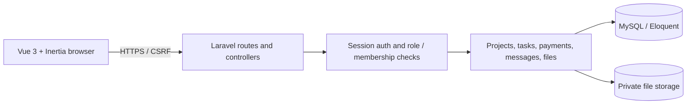

# System architecture

## Stack and request path

Laravel 12 (PHP 8.2) owns routing, validation, sessions, authorization and persistence. Vue 3 pages are served through Inertia.js; Vite compiles the client assets. MySQL is the target relational database. Files use Laravel's private local disk in this MVP.

Inertia page routes provide the dashboard and mutations. `/api/me` is the only JSON API route currently exposed. Controllers authorize each resource operation, validate payloads, and return redirects with flash/field errors. Eloquent models express relationships; migrations are the source of schema truth.

## Modules

- Identity: users, hashed passwords, session login/logout, role field.
- Delivery: projects, member pivot, tasks and derived completion.
- Finance: admin-entered payment records (no gateway integration).
- Collaboration: project messages and private attachments.
- Presentation: role-specific dashboards, project list/detail pages.

## Data boundaries

Every project detail, message, file operation and list query applies an admin/owner/member check. Storage paths are never exposed; downloads stream through an authorized controller. Production can replace private local storage with an S3-compatible private bucket without changing the access rule.
