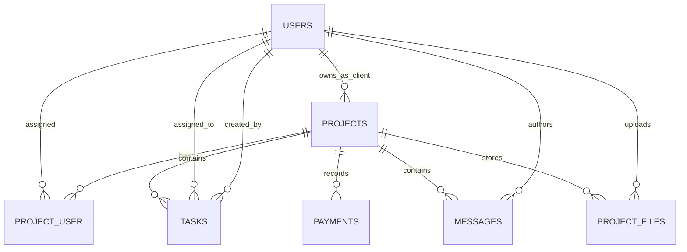

# Database ERD

## Tables

- `users`: id, name, unique email, password hash, role (`admin|client|team|intern`), timestamps.
- `projects`: client FK, unique slug, name/description, status, priority, decimal budget, start/due dates, progress percentage.
- `project_user`: project/member FKs; unique project-user membership pair.
- `tasks`: project FK, nullable assignee FK, creator FK, title/description, status, priority, due date.
- `payments`: project FK, amount/currency, status, method/reference, paid/due dates.
- `messages`: project and author FKs, body.
- `project_files`: project and uploader FKs, original name, private storage path, detected MIME type, byte size.
- `password_reset_tokens`: Laravel reset token storage (reset workflow not yet surfaced in UI).

Cascade deletion is used for project-owned records and user-owned uploaded data; task assignee deletion nulls assignment. User role integrity is validated at write boundaries; a database enum/check constraint should be added when portability requirements are decided.
